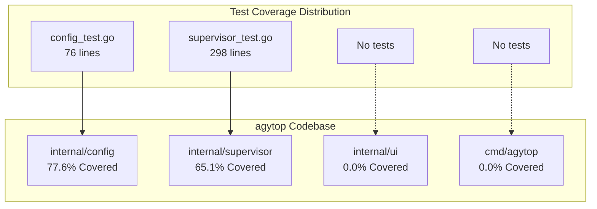
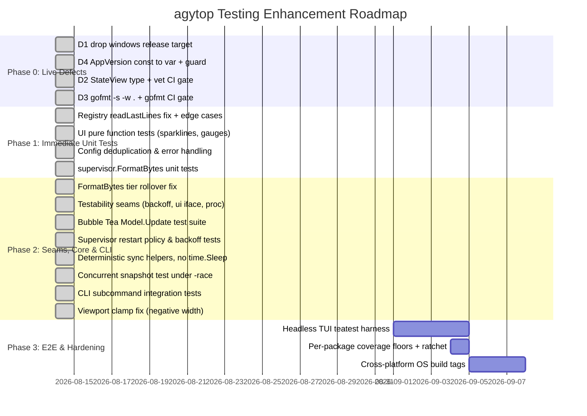

# agytop Testing Assessment & Recommendations

**Date:** August 14, 2026  
**Repository:** `dbogle/agytop`  
**Scope:** Unit Testing, Integration Testing, End-to-End (E2E) Testing, Concurrency & CI/CD Pipeline  
**Audited against:** commit `e515fd2` (branch `main`), go1.22.6 linux/amd64  
**Status:** Phase 0 remediated — see [§7](#7-remediation-log-phase-0)

Every coverage figure, line count, file reference, and defect in this document was reproduced against the working tree rather than inferred. Commands used: `go test -cover ./...`, `go vet ./...`, `gofmt -s -l .`, `GOOS=windows GOARCH=amd64 go build ./...`, and a `-ldflags` version-injection build. Where a recommended test is expected to fail on first run, that is stated inline rather than left for the implementer to discover.

**This document is kept as a record of what the audit found, not rewritten as the findings are fixed.** Defect sections describe the code as audited at `e515fd2` and carry a resolution note where remediation has landed. Phases 1–3 remain outstanding.

---

## 1. Executive Summary

A comprehensive audit of the test implementation in `agytop` was conducted across all packages, CLI entry points, and continuous integration workflows.

While the codebase features sound concurrency primitives, detached process management, and clean domain boundaries, **test coverage is heavily concentrated in backend lifecycle orchestration**, leaving the Terminal User Interface (TUI) and CLI layers completely untested.

The absence of tests at those layers is not only a coverage statistic. Because CI runs neither `go vet` nor a Windows build, and because no test asserts on CLI *output*, four defects have accumulated in paths nothing checks — including a release target that does not compile and a version string that is wrong in every published binary.

```
                          AUDITED (e515fd2)      CURRENT
Total Production Code :   3,470 lines            3,588 lines
Total Test Code       :     374 lines            2,837 lines
Code-to-Test Ratio    :    ~10:1                   ~1.3:1
Total Statement Cov.  :    36.1%                   71.5%
```

### Live Defects Found During This Audit

Four defects were present at `e515fd2`, independent of any test that might be written. All four were small fixes, and each was a prerequisite for a CI gate recommended later in this document — so they were taken ahead of new test-writing work (see [Phase 0](#phase-0-live-defects-fix-before-writing-new-tests) and the [remediation log](#7-remediation-log-phase-0)).

| # | Defect | Impact | Status | Detail |
| :-- | :--- | :--- | :--- | :--- |
| **D1** | `GOOS=windows go build ./...` fails with 7 compile errors | GoReleaser ships `windows/amd64`; the next `v*` tag fails its release build | ✅ Fixed — target dropped | [§3.3.2](#332-windows-portability--currently-broken-d1) |
| **D2** | `go vet ./...` fails with 8 lock-copy errors | Blocks adopting `vet` as a CI gate, which CONTRIBUTING.md already requires locally | ✅ Fixed — `StateView` | [§2.3.5](#235-lock-copying-in-the-uisupervisor-boundary-d2) |
| **D3** | `gofmt -s -l .` reports 3 unformatted files | CONTRIBUTING.md line 53 requires `gofmt -s -w .`; CI never verifies it | ✅ Fixed + CI gate | `cmd/agytop/main.go`, `internal/ui/keymap.go`, `internal/ui/styles.go` |
| **D4** | `AppVersion` is a `const`, so GoReleaser's `-X main.AppVersion` is a silent no-op | Every released binary reports `v0.1.0` regardless of tag | ✅ Fixed + guarded | [§2.4.4](#244-version-injection-is-a-no-op-d4) |

### Coverage Scorecard by Package

Coverage as audited at `e515fd2`, alongside the current figure after Phase 0. The Phase 0 movement is a side effect of adding regression guards for D2 and D4, not of the coverage work in Phases 1–3, which is still outstanding.

| Package / Module | Prod Lines | Test Lines | Audited | Now | Health Rating | Key Status |
| :--- | :---: | :---: | :---: | :---: | :---: | :--- |
| [`internal/config`](file:///home/larry/repos/agytop/internal/config/config.go) | 202 | 338 | 77.6% | **90.6%** | 🟢 Strong | Scope precedence/dedup across all four scopes, malformed-JSON handling, `GetDisplayName` fallbacks, plugin traversal. |
| [`internal/supervisor`](file:///home/larry/repos/agytop/internal/supervisor/supervisor.go) | 1,596 | 1,342 | 65.1% | **76.5%** | 🟢 Strong | Restart policies, backoff growth/cap via the injected fields, `/proc` parsers from fixtures, `readLastLines`, `FormatBytes`, `ClearLogs`, and the snapshot-boundary concurrency test. SIGKILL fallback and reattachment-crash paths still untested. |
| [`internal/ui`](file:///home/larry/repos/agytop/internal/ui/model.go) | 1,502 | 1,024 | 0.0% | **72.3%** | 🟢 Strong | Pure functions, both modals, search filtering, navigation bounds, resize clamping, all six action keys via a fake, and the async result messages. Full-program flows still need the Phase 3 harness. |
| [`cmd/agytop`](file:///home/larry/repos/agytop/cmd/agytop/main.go) | 237 | 133 | 0.0% | **0.0%** | 🟡 Instrument Blind | `--version`, `--list`, `--dry-run` exit codes, diagnostic markers, and unknown-flag handling are all covered — but every test `exec`s a built binary, which the coverage instrument cannot see into. Real coverage is substantial; the number stays 0 until an in-process refactor. |
| **Total / Repository** | **3,588** | **2,837** | 36.1% | **71.5%** | 🟢 Overall | Ratio improved ~10:1 → ~1.3:1. Phases 0–2 complete; Phase 3 outstanding. |

---

## 2. Unit Testing Deep Dive



### 2.1. `internal/config` (77.6% Coverage)
Located in [`internal/config/config_test.go`](file:///home/larry/repos/agytop/internal/config/config_test.go).

#### What is Tested
* [`LoadSidecarFromFile`](file:///home/larry/repos/agytop/internal/config/config.go#L67-L95): Correctly unmarshals valid `sidecar.json`, sets default restart policy (`always`), extracts directory ID, and computes `EffectiveWorkingDir()`.
* [`DiscoverSidecars`](file:///home/larry/repos/agytop/internal/config/config.go#L98-L165): Basic directory scanning with multiple sidecar subdirectories.

#### Critical Gaps & Missing Test Cases
1. **Scope Deduplication Precedence**:
   * Specification rule: Earlier scopes win over later scopes (`Custom` > `Workspace` > `Global` > `Plugin`).
   * *Gap:* No test asserts that when the same sidecar ID exists in both `.agents/sidecars/foo` and `~/.gemini/config/sidecars/foo`, the workspace version takes precedence and deduplicates the global one.
2. **Malformed / Invalid JSON Handling**:
   * *Gap:* [`LoadSidecarFromFile`](file:///home/larry/repos/agytop/internal/config/config.go#L67-L95) error returns on invalid syntax, empty files, or non-existent files are untested.
3. **Display Name Fallback Logic**:
   * [`GetDisplayName()`](file:///home/larry/repos/agytop/internal/config/config.go#L45-L53) only has 40% branch coverage. Fallback when `DisplayName` is empty to `ID`, and fallback when both are empty to `"Unnamed Sidecar"`, are unexercised.
4. **Plugin Subdirectory Traversal**:
   * [`DiscoverSidecars`](file:///home/larry/repos/agytop/internal/config/config.go#L146-L162) traverses `~/.gemini/config/plugins/*/sidecars/`. Non-directory plugin entries or nested structures are not tested.

---

### 2.2. `internal/supervisor` (65.1% Coverage)
Located in [`internal/supervisor/supervisor_test.go`](file:///home/larry/repos/agytop/internal/supervisor/supervisor_test.go).

#### What is Tested
* [`TestSupervisorLifecycleAndDryRun`](file:///home/larry/repos/agytop/internal/supervisor/supervisor_test.go#L12-L94): Dry-run validation execution, log capture, process startup, PID extraction, and graceful stopping.
* [`TestSupervisorScheduledLifecycle`](file:///home/larry/repos/agytop/internal/supervisor/supervisor_test.go#L96-L156): Arming scheduled tasks, status transitions (`STOPPED` → `SCHEDULED`), manual execution triggering, and pausing.
* [`TestSupervisorRunHistoryAndStats`](file:///home/larry/repos/agytop/internal/supervisor/supervisor_test.go#L158-L229): Multi-run execution history recording, exit code tracking, snippet capture, and mathematical percentage calculations in [`GetRunStats()`](file:///home/larry/repos/agytop/internal/supervisor/process.go#L215-L234).
* [`TestDetachedProcessReattachment`](file:///home/larry/repos/agytop/internal/supervisor/supervisor_test.go#L231-L298): Detached execution (`Setsid: true`), session termination without killing child processes, and supervisor reattachment via injectable [`NewRegistryAt`](file:///home/larry/repos/agytop/internal/supervisor/registry.go#L49-L57).

#### Critical Gaps & Missing Test Cases
1. **Restart Policies & Exponential Backoff**:
   * [`runProcessLoop`](file:///home/larry/repos/agytop/internal/supervisor/supervisor.go#L637-L787) implements `RestartAlways`, `RestartOnFailure`, and `RestartNever` with exponential backoff (500ms → 30s cap).
   * *Gap:* Zero tests verify that a failing process triggers backoff, increments `Restarts`, or respects `RestartOnFailure` vs `RestartNever`.
   * **Split this into two pieces of work — they have different prerequisites.** The *policy* branch ([`supervisor.go#L746-L754`](file:///home/larry/repos/agytop/internal/supervisor/supervisor.go#L746-L754)) is testable today: a process that exits immediately hits the first restart after the 500ms base delay, so each policy case costs well under a second. The *backoff curve* is not testable as written — `backoff` and `maxBackoff` are function-local variables ([`supervisor.go#L639-L640`](file:///home/larry/repos/agytop/internal/supervisor/supervisor.go#L639-L640)) with no seam. Observing 500ms → 1s → 2s growth burns ~3.5s of wall clock, and reaching the 30s cap would take a minute. See [§2.5](#25-testability-blockers-code-changes-required-before-tests-can-be-written).
2. **Reverse Log Seeking (`readLastLines`)**:
   * [`readLastLines`](file:///home/larry/repos/agytop/internal/supervisor/registry.go#L207-L244) uses chunked backward seeking (`ReadAt`) from EOF to tail multi-MB files without memory exhaustion.
   * *Gap:* Untested on files larger than `tailChunkSize` (64KB), files without trailing newlines, single-line files, or 0-byte files.
   * **Decide the 0-byte contract before writing the test.** On an empty file the loop never runs, so `data` is nil and [`strings.Split("", "\n")`](file:///home/larry/repos/agytop/internal/supervisor/registry.go#L233) yields `[]string{""}` — one empty line, not an empty slice. The recommended test will hit this on its first run; treat it as a contract bug to fix rather than behavior to codify.
   * *Correction to an earlier draft of this section, which claimed callers therefore tail a blank line out of an empty log.* They do not. `TailFile` is the only caller and it already guards with `if l != ""` before `AddLog` ([`registry.go#L259`](file:///home/larry/repos/agytop/internal/supervisor/registry.go#L259)), so the spurious entry is filtered and there is **no user-visible symptom**. The fix is still worth making — the next caller will not necessarily filter, and a function documented as returning "up to maxLines complete lines" should not invent one — but it is API hygiene, not a live bug, and should not be described as user-facing in a changelog.
   * The >64KB case matters more than its position in this list suggests: the partial-first-line drop ([`registry.go#L235-L239`](file:///home/larry/repos/agytop/internal/supervisor/registry.go#L235-L239)) only executes when `pos > 0`, i.e. only on multi-chunk reads. A single-chunk test — like the template in §6.2 — never reaches the logic the function exists for.

> **✅ Resolved (Phase 1).** `readLastLines` now returns a nil slice when the trimmed content is empty, and its doc comment states the contract. `internal/supervisor/registry_test.go` covers all six cases: the basic tail, the >64KB multi-chunk read with its partial-line drop, a 0-byte file, a newlines-only file, a file with no trailing newline, and `maxLines` exceeding the lines available. `TestReadLastLinesEmptyFile` was confirmed to be the only one that fails against the unfixed function (`got 1 lines ([""]), want 0`) — the other five pass either way, so the guard is precisely targeted rather than incidentally coupled.
3. **Reattached Process Liveness & Orphan Synthesis**:
   * [`watchReattachedProcess`](file:///home/larry/repos/agytop/internal/supervisor/supervisor.go#L126-L166) (22.2% coverage) polls unmonitored PIDs and triggers restarts if configured for `always`.
   * *Gap:* No test simulates an unmonitored child process crashing after reattachment.
4. **Process Termination Timeouts & Fallback to SIGKILL**:
   * [`killProcessGroup`](file:///home/larry/repos/agytop/internal/supervisor/process.go#L330-L356) and [`TerminatePID`](file:///home/larry/repos/agytop/internal/supervisor/registry.go#L174-L196) attempt graceful SIGTERM, wait up to 800ms / 1.5s, then force SIGKILL.
   * *Gap:* The SIGKILL fallback branch is never tested against stubborn processes ignoring SIGTERM.
5. **Ring Buffer Bounds & Eviction**:
   * Ring buffers exist for logs ([`MaxLogs = 1000`](file:///home/larry/repos/agytop/internal/supervisor/process.go#L123)), run history ([`MaxHistory = 50`](file:///home/larry/repos/agytop/internal/supervisor/process.go#L125)), and metric samples ([`MaxMetricSamples = 360`](file:///home/larry/repos/agytop/internal/supervisor/process.go#L116)).
   * *Gap:* No tests verify that items shift properly without memory leaks once limits are exceeded.
6. **Telemetry & Metrics Parsing**:
   * [`readLinuxMetrics`](file:///home/larry/repos/agytop/internal/supervisor/process.go#L281-L327) and [`FormatBytes`](file:///home/larry/repos/agytop/internal/supervisor/process.go#L368-L379) are 0% tested.

---

### 2.3. `internal/ui` (0.0% Coverage)
Located in [`internal/ui/`](file:///home/larry/repos/agytop/internal/ui/) (1,479 lines across `model.go`, `modals.go`, `keymap.go`, `styles.go`).

#### Critical Gaps & Missing Test Cases
1. **Pure Rendering & Calculation Functions**:
   * [`renderSparkline`](file:///home/larry/repos/agytop/internal/ui/model.go#L828-L858): Tests are needed for unicode block selection (`sparkBlocks`), window width clipping, empty datasets, and zero/negative scaling values.
   * [`renderAsciiGauge`](file:///home/larry/repos/agytop/internal/ui/model.go#L871-L892): Tests needed for 0%, 50%, 100%, and overflow value rendering.
   * [`uint64sToFloat64s`](file:///home/larry/repos/agytop/internal/ui/model.go#L862-L868): Type conversion integrity.
2. **Bubble Tea `Model.Update` State Machine**:
   * Keybinding routing (`s`, `x`, `r`, `d`, `t`, `h`, `v`, `l`, `a`, `c`, `?`, `q`, `tab`, `j`/`k`).
   * Asynchronous command handlers: [`stopSidecarCmd`](file:///home/larry/repos/agytop/internal/ui/model.go#L28-L33) returning [`stopResultMsg`](file:///home/larry/repos/agytop/internal/ui/model.go#L23-L26) and [`restartSidecarCmd`](file:///home/larry/repos/agytop/internal/ui/model.go#L42-L47) returning [`restartResultMsg`](file:///home/larry/repos/agytop/internal/ui/model.go#L37-L40).
   * Search filtering: Matching against ID, DisplayName, Scope, and Status; escaping and clearing search mode.
3. **Modal Display Overlays**:
   * [`RenderDryRunModal`](file:///home/larry/repos/agytop/internal/ui/modals.go#L14-L91), [`RenderHelpModal`](file:///home/larry/repos/agytop/internal/ui/modals.go#L94-L154), [`RenderConfigModal`](file:///home/larry/repos/agytop/internal/ui/modals.go#L157-L177), and [`RenderRunHistoryModal`](file:///home/larry/repos/agytop/internal/ui/modals.go#L180-L270) have zero test coverage.
4. **Terminal Resizing & Layout Calculation**:
   * Handling [`tea.WindowSizeMsg`](file:///home/larry/repos/agytop/internal/ui/model.go#L144-L148) and dimension clamping for small terminals (`width < 32`, `height < 8`).

#### 2.3.5. Lock-Copying in the UI/Supervisor Boundary (D2)

`go vet ./...` currently fails with 8 errors, every one of them in `internal/ui`, and every one rooted in the same design decision: `SidecarState` embeds a `sync.RWMutex`, and the UI passes `SidecarState` around **by value**.

```
modals.go:157:30: RenderConfigModal passes lock by value
modals.go:180:34: RenderRunHistoryModal passes lock by value
model.go:110:10:  range var s copies lock
model.go:116:33:  call of append copies lock value
model.go:473:29:  call of RenderConfigModal copies lock value
model.go:478:33:  call of RenderRunHistoryModal copies lock value
model.go:549:9:   range var s copies lock
model.go:607:8:   assignment copies lock value to s
```

**This is not a live deadlock, and the report should not be read as one.** [`Snapshot()`](file:///home/larry/repos/agytop/internal/supervisor/process.go#L237-L277) builds a *fresh struct literal* rather than dereferencing `*s`, so the returned value's mutex is zero-valued and unlocked. The UI does call locking methods on those copies — [`GetRunStats()`](file:///home/larry/repos/agytop/internal/ui/modals.go#L184) and [`model.go#L760`](file:///home/larry/repos/agytop/internal/ui/model.go#L760) — and each simply locks the copy's own private mutex. It works.

What it costs is real anyway:
* **It blocks the `vet` CI gate.** `go vet ./...` cannot be added to CI while it exits non-zero, even though CONTRIBUTING.md line 45 tells contributors to run it.
* **The type is copy-unsafe by construction.** The current safety depends entirely on `Snapshot()` never being rewritten as `snap := *s`. If it ever is — while holding `RLock`, as it does — the copy inherits a read-locked mutex and the next `Lock()` on it deadlocks. Nothing in the type system or the test suite prevents that refactor.

*Recommended fix:* give the snapshot its own mutex-free type (e.g. `type StateView struct{...}`), or hold the mutex behind a pointer. Either silences all 8 errors and makes the copy semantics explicit.

> **✅ Resolved.** The view-type option was taken. `supervisor.StateView` now carries the 17 snapshot fields with no mutex and none of the unexported runtime fields (`cmd`, `cancelFunc`, `stopChan`); `Snapshot()`, `GetAllStates()`, and `GetState()` return it, `GetRunStats()` moved onto it lock-free, and `internal/ui` was retyped. `*SidecarState` remains the live, mutex-guarded type. `go vet ./...` is clean and gated in CI. Details in [§7](#7-remediation-log-phase-0).

---

### 2.4. `cmd/agytop` (0.0% Coverage)
Located in [`cmd/agytop/main.go`](file:///home/larry/repos/agytop/cmd/agytop/main.go) (237 lines).

#### Critical Gaps & Missing Test Cases
1. **Flag Parsing**:
   * Validation of `-c`/`--config`, `--demo`, `-d`/`--dry-run`, `-l`/`--list`, and `-v`/`--version`.
2. **Non-Interactive Subcommands**:
   * `--list` output formatting and sidecar count.
   * `--dry-run <id>` diagnostic output and exit code contract (`os.Exit(0)` on pass, `os.Exit(1)` on failure or non-existent ID).
3. **Demo Suite Initializer**:
   * [`setupDemoConfigs`](file:///home/larry/repos/agytop/cmd/agytop/main.go#L132-L237) generation of mock sidecars (`data-indexer`, `cron-nightly-report`, `telemetry-bridge`, `flaky-service`).
   * *Hazard for the test author:* `setupDemoConfigs` writes into [`os.Getwd()`](file:///home/larry/repos/agytop/cmd/agytop/main.go#L133-L137), creating `.agents/sidecars/` in whatever directory the process starts in. A test that shells out to `--demo` without setting `cmd.Dir` writes `cmd/agytop/.agents/` into the repo, and `.agents/` is not in `.gitignore`. Always pin `cmd.Dir` to `t.TempDir()`.

#### 2.4.4. Version Injection is a No-Op (D4)

[`AppVersion`](file:///home/larry/repos/agytop/cmd/agytop/main.go#L17) is declared as a `const`. The linker's `-X` flag only writes to string **variables** — a `const` is inlined at compile time and has no symbol to patch — so the `-s -w -X main.AppVersion={{.Version}}` ldflags in [`.goreleaser.yaml`](file:///home/larry/repos/agytop/.goreleaser.yaml#L24-L25) do nothing:

```console
$ go build -ldflags "-X main.AppVersion=v9.9.9-test" -o /tmp/agytop ./cmd/agytop
$ /tmp/agytop --version
agytop v0.1.0 (Google Antigravity 2.0)
```

Every published release reports `v0.1.0`. The one-character fix is `var AppVersion = "v0.1.0"`.

This also makes the CLI test in §6.3 worse than useless as originally drafted: asserting `strings.Contains(out, AppVersion)` compares the binary's output against the same compile-time constant the binary was built from, so it passes unconditionally *and* passes while the real release contract is broken. The test must assert against a value it injected itself.

> **✅ Resolved.** `AppVersion` is now a `var`, and `cmd/agytop/main_test.go` guards it with `TestCLIVersionReflectsLdflags`, which builds with an injected version and asserts `--version` reflects it. Verified: `-X main.AppVersion=v9.9.9-check` now prints `agytop v9.9.9-check`.

---

### 2.5. Testability Blockers (Code Changes Required Before Tests Can Be Written)

Sections 2.1–2.4 enumerate *what* is untested. This section covers a question they leave open: whether the recommended tests can actually be written against the code as it stands. For three of them the answer is no, and the roadmap in §5 sequences the seam ahead of the test accordingly.

The repo already contains the pattern to follow, twice: [`NewRegistryAt(baseDir string)`](file:///home/larry/repos/agytop/internal/supervisor/registry.go#L49-L57) exists purely so tests can redirect `~/.agytop`, and [`NewSupervisorWithRegistry(configs, registry)`](file:///home/larry/repos/agytop/internal/supervisor/supervisor.go#L36) exists to inject it. Together they are what makes `TestDetachedProcessReattachment` possible. Each seam below is the same idea applied to a different hard-coded dependency.

> **✅ All three seams landed in Phase 2.** `baseBackoff`/`maxBackoff` are `Supervisor` fields defaulted to 500ms/30s in the constructor both entry points share (verified: `NewSupervisor` delegates to `NewSupervisorWithRegistry`, so production is unaffected). `internal/ui` declares a nine-method `supervisorAPI` interface satisfied structurally by `*supervisor.Supervisor`, with all four concrete-type sites moved over and `cmd/agytop` untouched. `readLinuxMetrics` now delegates to pure `parseStatmRSS`/`parseStatusVmRSS` parsers testable from fixtures on any OS.

| Blocker | Blocks | Proposed seam |
| :--- | :--- | :--- |
| `backoff` / `maxBackoff` are locals in [`runProcessLoop`](file:///home/larry/repos/agytop/internal/supervisor/supervisor.go#L639-L640) | Backoff-curve tests (§5 Phase 2) | Promote to `Supervisor` fields defaulting to 500ms/30s; tests shrink them to ~5ms/50ms |
| [`NewModel(sup *supervisor.Supervisor)`](file:///home/larry/repos/agytop/internal/ui/model.go#L79) takes a concrete type | `Update` tests for `s` / `x` / `r` / `d`, which would otherwise spawn real processes | Consumer-side interface declared in `internal/ui` (`GetAllStates`, `Start`, `Stop`, `Restart`, `DryRun`, `TriggerScheduled`, `Shutdown`) — no supervisor change needed |
| [`readLinuxMetrics`](file:///home/larry/repos/agytop/internal/supervisor/process.go#L281-L327) reads `/proc/<pid>` directly | Metrics-parsing tests across Linux/macOS shapes | Split parsing from I/O: a pure `parseStatm([]byte)` / `parseStatus([]byte)` fed by fixture bytes |

Note the scope limit: navigation keys (`j`/`k`/`g`/`G`), `Tab`, search entry/escape, and every modal toggle (`h`, `v`, `?`) touch no supervisor method and are testable **today** against a real `NewSupervisor` holding un-started configs. Only the action keys need the interface.

---

## 3. End-to-End (E2E) & Integration Testing Evaluation

### 3.1. CI Workflow Review ([`.github/workflows/ci.yml`](file:///home/larry/repos/agytop/.github/workflows/ci.yml))

```yaml
# Existing CI Pipeline Summary
Matrix:
  OS: [ubuntu-latest, macos-latest]
  Go: ['1.22.x', '1.23.x']
Steps:
  1. go mod verify
  2. go test -v -race ./...
  3. go build -v -o bin/agytop ./cmd/agytop
  4. ./bin/agytop --version
  5. ./bin/agytop --demo --list
```

#### Strengths
* **Race Detection**: Always runs with `-race` across all test packages.
* **Matrix Validation**: Validates Linux and macOS across current and previous Go versions.
* **Basic Smoke Testing**: Ensures binary builds and executes without crashing on basic flags.

#### Deficiencies
* ~~**No Static Analysis Gate (D2)**~~ — ✅ **fixed.** CI never ran `go vet ./...`, even though CONTRIBUTING.md line 45 instructs contributors to; this is how 8 lock-copy errors ([§2.3.5](#235-lock-copying-in-the-uisupervisor-boundary-d2)) reached `main` unnoticed. A `Vet` step now runs on every matrix leg.
* ~~**No Formatting Gate (D3)**~~ — ✅ **fixed.** A `Check formatting` step now runs `gofmt -s -l .` and fails with the offending filenames. It is gated to the `ubuntu-latest` + `1.23.x` leg, since formatting is OS- and version-independent and there is no value in paying for it four times.
* ~~**No Windows Compile Check (D1)**~~ — ✅ **resolved differently.** The Windows release target was dropped rather than repaired, so there is no longer anything for a `GOOS=windows` check to protect. See [§3.3.2](#332-windows-portability--currently-broken-d1).
* **Superficial Smoke Checks**: The CI checks only verify that `--version` and `--demo --list` exit cleanly; they do not assert stdout contents, error output, or exit codes. Note that `--version` currently passes while reporting the wrong version ([D4](#244-version-injection-is-a-no-op-d4)) — an exit-code-only check cannot see that class of bug.
* **Missing CLI Subcommand Tests**: `--dry-run <id>` (the primary headless diagnostic workflow) is never run in CI.
* **No Coverage Reporting**: CI does not generate coverage reports (`coverage.out`) or enforce regression thresholds.
* **CWD Pollution in the Smoke Step**: `./bin/agytop --demo --list` runs from the repo root and writes `.agents/sidecars/` into the checkout. Harmless on a throwaway runner, but it makes the step order-dependent and is the same trap described in [§2.4](#24-cmdagytop-00-coverage) for local test runs.

---

### 3.2. Headless TUI / Simulated Terminal E2E Testing
* **Major Architectural Gap**: There is currently no test harness simulating interactive terminal sessions.
* **Most of the value does not require a harness at all.** A Bubble Tea `Update` is an ordinary function — `m.Update(tea.KeyMsg{Type: tea.KeyRunes, Runes: []rune{"j"}})` returns `(tea.Model, tea.Cmd)` and can be asserted on directly, with no program loop, no virtual terminal, and no new dependency. Keybinding routing, search filtering, modal flags, `tea.WindowSizeMsg` clamping, and `stopResultMsg`/`restartResultMsg` handling are all reachable this way. Exhaust this approach before reaching for a harness; it is why the `Model.Update` suite sits in Phase 2 and `teatest` in Phase 3.
* **Reserve `teatest` for what direct calls cannot reach**: full-program flows that depend on rendered screen output, `tea.Cmd` scheduling, and the 200ms `tickMsg` cadence interacting with real supervisor state.
  * Import path is [`github.com/charmbracelet/x/exp/teatest`](https://pkg.go.dev/github.com/charmbracelet/x/exp/teatest) — verified to resolve, and the variant compatible with the pinned `bubbletea v0.25.0`.
  * *Cost to weigh:* this is a new direct dependency on a repo that currently has exactly three (`bubbles`, `bubbletea`, `lipgloss`), and it must stay compatible with the `go 1.22.6` directive and the 1.22.x CI leg.

---

### 3.3. Cross-Platform & OS Disparities

#### 3.3.1. macOS / Darwin Telemetry Fallback
* `/proc/<pid>/statm` and `/proc/<pid>/status` do not exist on macOS.
* `readLinuxMetrics` falls back to `ps -p <pid> -o %cpu=`, while memory returns 0.
* *Gap:* No CI integration test verifies that agytop handles memory returning 0 on macOS without UI artifacts.
* The `parseStatm`/`parseStatus` seam proposed in [§2.5](#25-testability-blockers-code-changes-required-before-tests-can-be-written) makes the Linux side testable from fixtures on any OS, leaving only the `ps` fallback genuinely platform-bound.

#### 3.3.2. Windows Portability — Currently Broken (D1)

This is not a portability *risk* to schedule for later. The Windows build does not compile today, and [`.goreleaser.yaml`](file:///home/larry/repos/agytop/.goreleaser.yaml#L14-L23) lists `windows` under `goos` with only `windows/arm64` ignored — so `windows/amd64` is a live release target that fails:

```console
$ GOOS=windows GOARCH=amd64 go build ./...
# agytop/internal/supervisor
internal/supervisor/process.go:340:14:    undefined: syscall.Kill
internal/supervisor/process.go:353:15:    undefined: syscall.Kill
internal/supervisor/registry.go:180:14:   undefined: syscall.Kill
internal/supervisor/registry.go:182:14:   undefined: syscall.Kill
internal/supervisor/registry.go:193:14:   undefined: syscall.Kill
internal/supervisor/registry.go:194:14:   undefined: syscall.Kill
internal/supervisor/supervisor.go:663:42: unknown field Setsid in struct literal of type syscall.SysProcAttr
```

The next `v*` tag fails at the GoReleaser Windows step. No test covers this because no *build* covers it: the CI matrix is `ubuntu-latest` + `macos-latest`, and `go vet`/`go build` are never run under `GOOS=windows`.

There are no `//go:build` constraints anywhere in the repo (`grep -rn "go:build" --include=*.go .` returns nothing), so all 7 sites are unguarded.

*Two independent fixes, in order:*
1. **Stop the bleeding (minutes):** add `GOOS=windows go build ./...` to CI so the break is visible, and either drop `windows` from `.goreleaser.yaml` or accept that releases are Linux/macOS only until step 2 lands. Shipping a target that cannot build is the actual defect; whether Windows is supported at all is a product decision this document does not make.
2. **Port properly (Phase 3):** extract process control into `process_unix.go` / `process_windows.go` behind `//go:build unix` / `//go:build windows`, with the Windows side using `taskkill`/`TerminateProcess` and job objects in place of `Setsid` + process-group signals.

> **✅ Resolved via step 1 — the platform was dropped, not ported.** `windows` is removed from `.goreleaser.yaml`'s `goos`, along with the now-dead `ignore` and `format_overrides` blocks; `CHANGELOG.md` records the removal under `[Unreleased]`. The rationale: agytop's supervision model rests on POSIX detached process groups and `/proc`, so a Windows binary that merely compiled would mismanage processes — worse than shipping none. **`GOOS=windows go build ./...` still fails, and that is now expected rather than a defect.** No Windows CI check was added, because there is no longer a Windows target to check. Step 2 remains available if Windows support is ever wanted; it would need `windows-latest` in the CI matrix to be meaningful.

---

## 4. Test Concurrency, Timing & Reliability Hazards

### 4.1. The `time.Sleep` Synchronization Anti-Pattern
All tests in [`supervisor_test.go`](file:///home/larry/repos/agytop/internal/supervisor/supervisor_test.go) use hardcoded sleep durations to synchronize with asynchronous goroutines — 10 calls in total, all convertible:

```go
// Current pattern in supervisor_test.go
if err := sup.Start("test-worker"); err != nil {
    t.Fatalf("Start failed: %v", err)
}
time.Sleep(250 * time.Millisecond) // Vulnerable to race conditions under CI load
state, _ := sup.GetState("test-worker")
```

#### Why This is a Hazard
* **Flakiness under CI Load**: On busy virtualized CI runners (e.g. GitHub Actions `macos-latest`), CPU throttling can delay process startup beyond 250ms, causing random test failures.
* **Slow Test Suites**: Arbitrary sleeps accumulate, increasing total CI duration.

#### Recommended Deterministic Polling Pattern
Replace arbitrary sleeps with a condition helper:

```go
func waitForCondition(t *testing.T, timeout time.Duration, condition func() bool) {
    t.Helper()
    deadline := time.Now().Add(timeout)
    for time.Now().Before(deadline) {
        if condition() {
            return
        }
        time.Sleep(10 * time.Millisecond)
    }
    t.Fatalf("timed out after %v waiting for condition", timeout)
}
```

### 4.2. `-race` Only Covers Paths That Actually Execute

§3.1 lists race detection as a CI strength, which it is — but the guarantee is narrower than the phrasing suggests. The race detector is a *runtime* instrument: it reports races on memory actually touched by code actually executed. It proves nothing about code no test reaches.

That matters here specifically because of where the coverage holes sit. `internal/ui` is at 0.0%, so **no test has ever exercised the UI/supervisor boundary under `-race`** — and that boundary is exactly where the copy semantics live ([§2.3.5](#235-lock-copying-in-the-uisupervisor-boundary-d2)): `GetAllStates()` deep-copying under `RLock` while `runProcessLoop`, `metricsLoop`, and `TailFile` mutate the same states from other goroutines. The suite is green under `-race` because nothing looks there.

*Highest-value concurrency test available today*, requiring no new seams:

```go
// Hammer GetAllStates() from several readers while live goroutines mutate
// state, so -race actually observes the snapshot boundary.
func TestConcurrentSnapshotsUnderLoad(t *testing.T) {
    sup := NewSupervisorWithRegistry(demoConfigs(t), NewRegistryAt(t.TempDir()))
    // start a sidecar so runProcessLoop + metricsLoop are live during the run

    var wg sync.WaitGroup
    for i := 0; i < 8; i++ {
        wg.Add(1)
        go func() {
            defer wg.Done()
            for j := 0; j < 200; j++ {
                for _, s := range sup.GetAllStates() {
                    _, _, _, _ = s.GetRunStats()
                    _ = len(s.Logs)
                }
            }
        }()
    }
    wg.Wait()
}
```

### 4.3. Test Hermeticity Is Unstated Policy

Commit `2c37211` ("stop reattachment test from touching the real `~/.agytop`") already fixed one leak, but neither the repo nor this document states the underlying rule — so the next test to touch the registry reintroduces it. Three concrete leak paths exist:

1. **`~/.agytop`** — the `Registry` default. Always construct via [`NewRegistryAt(t.TempDir())`](file:///home/larry/repos/agytop/internal/supervisor/registry.go#L49-L57).
2. **`~/.gemini/config/sidecars/` and `~/.gemini/config/plugins/*/`** — the global and plugin discovery scopes. A `--list` test asserting a sidecar *count* is non-hermetic by construction: it picks up the developer's real global sidecars, so it passes locally and fails in CI (or the reverse). Set `HOME` to a temp dir for anything that exercises discovery.
3. **CWD** — `--demo` writes `.agents/sidecars/` relative to the working directory ([§2.4](#24-cmdagytop-00-coverage)), and `.agents/` is not gitignored.

*Recommended policy, worth a line in CONTRIBUTING.md:* every test either sets `HOME` to `t.TempDir()` or passes explicit paths, and no test asserts against a directory it did not itself create.

---

## 5. Actionable Implementation Roadmap



### Phase 0: Live Defects (Fix Before Writing New Tests) — ✅ Complete

These were not test-coverage work; they were defects found while auditing, and three of the four were prerequisites for gates recommended in later phases. Sequencing them first means Phase 1 lands on a repo where `vet` and `gofmt` are already enforced, so new code cannot re-break them.

1. **D1 — Unbreak the Windows target** ([§3.3.2](#332-windows-portability--currently-broken-d1)): ✅ platform dropped from `.goreleaser.yaml`; no Windows CI check added, since there is no longer a target to check.
2. **D4 — `const AppVersion` → `var AppVersion`** ([§2.4.4](#244-version-injection-is-a-no-op-d4)): ✅ one character, plus a regression guard that builds with an injected version.
3. **D2 — Remove the mutex from copied state** ([§2.3.5](#235-lock-copying-in-the-uisupervisor-boundary-d2)): ✅ `supervisor.StateView` introduced; `go vet ./...` now gated in CI.
4. **D3 — `gofmt -s -w .`** on the three unformatted files: ✅ done, with a CI gate that prints the offending filenames on failure.

Full detail, verification output, and two follow-on findings are in [§7](#7-remediation-log-phase-0).

### Phase 1: High-Priority Unit Tests (Target Coverage: ~60%) — ✅ Complete

Repo coverage landed at **60.5%**, on target.

1. ~~**Create `internal/ui/model_test.go`**~~ — ✅ **done.** `renderSparkline` across lengths, empty slices, single values, clipping, and non-positive `maxVal`; block selection pinned at both endpoints; `renderAsciiGauge` at 0/50/100%, overflow, negative, and rounding; plus `uint64sToFloat64s`.
2. ~~**Create `internal/supervisor/process_test.go`**~~ — ✅ **done.** `FormatBytes` across B→PB with every tier boundary and just-below-boundary value. Note this function lives in [`internal/supervisor/process.go#L371`](file:///home/larry/repos/agytop/internal/supervisor/process.go#L371), **not** in `internal/ui` — its test belongs in the supervisor package, not alongside the sparkline tests. The boundary cases surfaced a real rollover bug; see [§7.4](#74-findings-surfaced-by-phase-1).
3. ~~**Create `internal/supervisor/registry_test.go`**~~ — ✅ **done.** Six cases covering the basic tail, the >64KB multi-chunk read and its partial-line drop, a 0-byte file, a newlines-only file, no trailing newline, and `maxLines` exceeding what is available. The 0-byte contract bug it surfaced is fixed (see [§2.2](#22-internalsupervisor-651-coverage) gap 2).
4. ~~**Enhance `internal/config/config_test.go`**~~ — ✅ **done.** Precedence proven across all four scopes (custom > workspace > global > plugin), plus malformed/empty/missing JSON, all three `GetDisplayName` fallbacks including whitespace-only, and plugin traversal with a non-directory entry. Coverage 77.6% → 90.6%.
   * *Implementation note for anyone extending these:* workspace scope resolves through `os.Getwd()`, and **`t.Chdir` is unavailable** — go.mod pins `go 1.22.6` and `t.Chdir` arrived in 1.24. The tests use an `os.Chdir` helper with `t.Cleanup` restoring the original. Combined with `t.Setenv("HOME", ...)` for the global and plugin scopes, this makes them process-global, so none of them may call `t.Parallel()`. Hermeticity was verified by running the suite under `HOME=/nonexistent`.

### Phase 2: Seams, Core Logic & CLI Testing (Target Coverage: ~80%)

0. **Land the testability seams first** ([§2.5](#25-testability-blockers-code-changes-required-before-tests-can-be-written)) — items 1 and 2 below are blocked without them:
   * Promote `backoff`/`maxBackoff` to `Supervisor` fields.
   * Introduce a consumer-side supervisor interface in `internal/ui` and have `NewModel` accept it.
1. **Bubble Tea `Model.Update` Tests**:
   * Testable with no seam: navigation keystrokes (`j`, `k`, `g`, `G`), filter input, modal toggles (`h`, `v`, `?`), `tea.WindowSizeMsg` clamping, and async message handling (`stopResultMsg`, `restartResultMsg`).
   * Requires the interface seam: action keys (`s`, `x`, `r`, `d`, `t`) — otherwise each assertion spawns real processes.
   * These are direct `m.Update(msg)` calls, not `teatest` — no harness or new dependency needed ([§3.2](#32-headless-tui--simulated-terminal-e2e-testing)).
2. **Supervisor Restart & Backoff Tests**:
   * *No seam needed* — `RestartAlways` on zero and non-zero exits, `RestartOnFailure` on code 0 (no restart) vs code 1 (restarts), `RestartNever`. Each costs roughly one 500ms base delay.
   * *Seam needed* — backoff doubling (500ms → 1s → 2s) and the 30s cap. With injected fields these run in milliseconds; without them the cap test alone takes a minute.
3. **Concurrency Test Under `-race`** ([§4.2](#42--race-only-covers-paths-that-actually-execute)):
   * Add `TestConcurrentSnapshotsUnderLoad` so the snapshot boundary is exercised by the race detector at all.
4. **CLI Subcommand Integration Tests (`cmd/agytop/main_test.go`)**:
   * Test `--dry-run` against successful and failing sidecars with exit code assertions (`os.Exit(0)` at [`main.go#L118`](file:///home/larry/repos/agytop/cmd/agytop/main.go#L118); `os.Exit(1)` at [`L100`](file:///home/larry/repos/agytop/cmd/agytop/main.go#L100), [`L116`](file:///home/larry/repos/agytop/cmd/agytop/main.go#L116), [`L127`](file:///home/larry/repos/agytop/cmd/agytop/main.go#L127)).
   * Test `--list` output structure — against a pinned `HOME` and `cmd.Dir`, never the ambient environment ([§4.3](#43-test-hermeticity-is-unstated-policy)).
   * Test `--version` against an **injected** value, which also serves as the regression test for D4.
5. **Eliminate `time.Sleep`**:
   * Switch all 10 sleep sites in `supervisor_test.go` to deterministic polling helpers.

### Phase 3: Long-Term E2E & Hardening
1. **Headless TUI E2E Harness (`teatest`)**:
   * Verify full interactive flows from launch to dry-run popup and termination — reserved for what direct `Update` calls cannot reach.
2. **Multi-Platform OS Isolation**:
   * Extract Unix process management to `process_unix.go` and `process_windows.go` with OS build tags, completing the D1 fix begun in Phase 0.
3. **CI Coverage Gates — per-package floors, not a repo-wide number**:
   * A single repo-wide threshold is the wrong instrument here. `internal/ui` carries ~317 lines of Lipgloss theme constants and a keybinding table (`styles.go`, `keymap.go`) that exist to be read, not executed; a 75% global gate pressures contributors into writing assertions against rendered ANSI to move a number.
   * Prefer **per-package floors** set just under current values (config 75%, supervisor 60%) plus a **ratchet rule**: no package's coverage may decrease in a PR. This catches regressions — the thing a gate is actually for — without inventing a target for untestable code.
   * Publish `coverage.out` as a CI artifact regardless, so trends are visible even where they aren't enforced.

---

## 6. Reference Implementation Templates

Every template below was executed against a scratch copy of the tree at `e515fd2` before being published here, so the expected results are observed rather than predicted:

| Template | Result |
| :--- | :--- |
| §6.1 sparkline + gauge (9 subtests) | **Pass** |
| §6.2 `TestReadLastLines`, `TestReadLastLinesAcrossChunkBoundary` | **Pass** |
| §6.2 `TestReadLastLinesEmptyFile` | **Fail** — `got 1 lines ([""]), want 0`, confirming the 0-byte bug |
| §6.3 `--list`, `--dry-run` exit codes | **Pass** — discovers exactly the 4 demo sidecars under a pinned `HOME` |
| §6.3 `TestCLIVersionReflectsLdflags` | **Fail** — `expected "v0.0.0-clitest", got: agytop v0.1.0`, confirming D4 |

The two failures were the intended outcome: each is a live defect this document reports, and each test is the regression guard for its fix.

**Current status of the two failures — both now fixed and merged:**
* `TestCLIVersionReflectsLdflags` — **passing**, at `cmd/agytop/main_test.go`; D4 is fixed and guarded.
* `TestReadLastLinesEmptyFile` — **passing**, at `internal/supervisor/registry_test.go`, alongside four more cases. The 0-byte contract bug is fixed; see [§2.2](#22-internalsupervisor-651-coverage).

### 6.1. UI Helper Tests (`internal/ui/model_test.go`)

> **Note on the earlier draft of this template.** Both tables previously declared an expectation field (`expected int`, `contains string`) that no assertion ever read; the sparkline case only checked for a non-empty string and the gauge case only checked that *some* block character appeared. Both tests passed for any implementation that returned text, including a wrong one. The versions below assert the actual contracts: `renderSparkline` pads to exactly `width` cells and returns `""` when `width <= 0`; `renderAsciiGauge` emits `round(ratio*width)` filled cells and always totals `width`.

Because both functions return Lipgloss-styled strings, comparisons must run on visible text. `lipgloss.Width` handles the geometry assertions, and a local regexp keeps content assertions dependency-free — deliberately avoiding a `termenv` import just to force a color profile.

```go
package ui

import (
	"regexp"
	"strings"
	"testing"

	"github.com/charmbracelet/lipgloss"
)

var ansiRE = regexp.MustCompile("\x1b\\[[0-9;]*m")

func visible(s string) string { return ansiRE.ReplaceAllString(s, "") }

func TestRenderSparkline(t *testing.T) {
	tests := []struct {
		name      string
		values    []float64
		maxVal    float64
		width     int
		wantWidth int
	}{
		{"empty values pad to full width", nil, 100.0, 10, 10},
		{"single value is left-padded", []float64{50.0}, 100.0, 5, 5},
		{"more values than width clips to newest", []float64{10, 20, 30, 40, 50}, 100.0, 3, 3},
		{"zero width renders nothing", []float64{10, 20}, 100.0, 0, 0},
		{"non-positive maxVal must not divide by zero", []float64{5, 5}, 0, 4, 4},
	}

	for _, tt := range tests {
		t.Run(tt.name, func(t *testing.T) {
			if got := lipgloss.Width(renderSparkline(tt.values, tt.maxVal, tt.width)); got != tt.wantWidth {
				t.Errorf("visible width = %d, want %d", got, tt.wantWidth)
			}
		})
	}
}

// Pin the ratio-to-block mapping at both endpoints so a change to sparkBlocks
// cannot pass silently.
func TestRenderSparklineBlockSelection(t *testing.T) {
	got := visible(renderSparkline([]float64{0, 100}, 100.0, 2))
	want := string([]rune{sparkBlocks[0], sparkBlocks[len(sparkBlocks)-1]})
	if got != want {
		t.Errorf("block selection = %q, want %q", got, want)
	}
}

func TestRenderAsciiGauge(t *testing.T) {
	tests := []struct {
		name       string
		val        float64
		maxVal     float64
		width      int
		wantFilled int
	}{
		{"empty", 0.0, 100.0, 10, 0},
		{"half", 50.0, 100.0, 10, 5},
		{"full", 100.0, 100.0, 10, 10},
		{"overflow clamps to full", 250.0, 100.0, 10, 10},
		{"negative clamps to empty", -5.0, 100.0, 10, 0},
		{"rounds to nearest cell", 44.0, 100.0, 10, 4},
		{"non-positive maxVal defaults to 100", 50.0, 0, 10, 5},
	}

	for _, tt := range tests {
		t.Run(tt.name, func(t *testing.T) {
			got := visible(renderAsciiGauge(tt.val, tt.maxVal, tt.width))
			filled := strings.Count(got, "█")
			empty := strings.Count(got, "░")

			if filled != tt.wantFilled {
				t.Errorf("filled cells = %d, want %d", filled, tt.wantFilled)
			}
			if filled+empty != tt.width {
				t.Errorf("total cells = %d, want %d", filled+empty, tt.width)
			}
		})
	}
}
```

### 6.2. Log Tailing Tests (`internal/supervisor/registry_test.go`)
```go
package supervisor

import (
	"bytes"
	"fmt"
	"os"
	"path/filepath"
	"reflect"
	"strings"
	"testing"
)

func TestReadLastLines(t *testing.T) {
	tmpDir := t.TempDir()
	logFile := filepath.Join(tmpDir, "test.log")

	content := "line 1\nline 2\nline 3\nline 4\nline 5\n"
	if err := os.WriteFile(logFile, []byte(content), 0644); err != nil {
		t.Fatalf("failed to write test log: %v", err)
	}

	f, err := os.Open(logFile)
	if err != nil {
		t.Fatalf("failed to open log: %v", err)
	}
	defer f.Close()

	lines, size, err := readLastLines(f, 3)
	if err != nil {
		t.Fatalf("readLastLines failed: %v", err)
	}

	expected := []string{"line 3", "line 4", "line 5"}
	if !reflect.DeepEqual(lines, expected) {
		t.Errorf("expected %v, got %v", expected, lines)
	}
	if size != int64(len(content)) {
		t.Errorf("expected size %d, got %d", len(content), size)
	}
}
```

This template is correct as written, but it only exercises the single-chunk path: at 35 bytes the loop reads once, `pos` reaches 0, and the partial-first-line drop never runs. The two cases below cover the logic the function actually exists for.

```go
// Forces multiple backward ReadAt calls (~250KB > the 64KB tailChunkSize), so
// the partial-first-line drop at registry.go#L235-L239 is exercised and the
// first returned line is asserted to be complete rather than truncated.
func TestReadLastLinesAcrossChunkBoundary(t *testing.T) {
	var buf bytes.Buffer
	const totalLines = 5000
	for i := 0; i < totalLines; i++ {
		fmt.Fprintf(&buf, "line %04d %s\n", i, strings.Repeat("x", 40))
	}

	logFile := filepath.Join(t.TempDir(), "big.log")
	if err := os.WriteFile(logFile, buf.Bytes(), 0644); err != nil {
		t.Fatalf("write: %v", err)
	}
	f, err := os.Open(logFile)
	if err != nil {
		t.Fatalf("open: %v", err)
	}
	defer f.Close()

	lines, size, err := readLastLines(f, 3)
	if err != nil {
		t.Fatalf("readLastLines: %v", err)
	}
	if size != int64(buf.Len()) {
		t.Errorf("size = %d, want %d", size, buf.Len())
	}
	if len(lines) != 3 {
		t.Fatalf("got %d lines, want 3", len(lines))
	}
	for i, got := range lines {
		want := fmt.Sprintf("line %04d %s", totalLines-3+i, strings.Repeat("x", 40))
		if got != want {
			t.Errorf("line %d = %q, want %q", i, got, want)
		}
	}
}

// Documents the 0-byte contract. This FAILS against the current
// implementation, which returns []string{""} because strings.Split("", "\n")
// yields one empty element (registry.go#L233). Fix the function rather than
// the assertion — an empty log should tail to nothing, not to a blank line.
func TestReadLastLinesEmptyFile(t *testing.T) {
	logFile := filepath.Join(t.TempDir(), "empty.log")
	if err := os.WriteFile(logFile, nil, 0644); err != nil {
		t.Fatalf("write: %v", err)
	}
	f, err := os.Open(logFile)
	if err != nil {
		t.Fatalf("open: %v", err)
	}
	defer f.Close()

	lines, size, err := readLastLines(f, 10)
	if err != nil {
		t.Fatalf("readLastLines: %v", err)
	}
	if size != 0 {
		t.Errorf("size = %d, want 0", size)
	}
	if len(lines) != 0 {
		t.Errorf("got %d lines (%q), want 0", len(lines), lines)
	}
}
```

### 6.3. CLI Subcommand Test (`cmd/agytop/main_test.go`)

Three corrections to the earlier draft of this template, each of which produced a test that was wrong rather than merely thin:

* **The version assertion was circular.** Comparing the binary's output against the `AppVersion` symbol the test itself is compiled with passes unconditionally, *and* passes while release version injection is broken ([D4](#244-version-injection-is-a-no-op-d4)). Build with an injected value and assert on that instead — the test then doubles as the D4 regression guard and fails today.
* **`--demo` wrote into the repo.** With no `cmd.Dir`, the subprocess inherits the test's working directory and `setupDemoConfigs` creates `cmd/agytop/.agents/sidecars/` on every run. `.agents/` is not gitignored.
* **Discovery read the developer's real `$HOME`.** Global and plugin scopes are scanned unconditionally, so any assertion about *which* or *how many* sidecars appear depends on the machine running the test.

```go
package main

import (
	"os"
	"os/exec"
	"path/filepath"
	"strings"
	"testing"
)

const testVersion = "v0.0.0-clitest"

// buildTestBinary compiles the CLI with an injected version so --version can be
// asserted against something the test controls.
func buildTestBinary(t *testing.T) string {
	t.Helper()
	binPath := filepath.Join(t.TempDir(), "agytop_test")
	build := exec.Command("go", "build", "-ldflags", "-X main.AppVersion="+testVersion, "-o", binPath, ".")
	if out, err := build.CombinedOutput(); err != nil {
		t.Fatalf("build failed: %v\n%s", err, out)
	}
	return binPath
}

// hermeticCmd pins both leak paths: CWD (--demo writes .agents/sidecars/ there)
// and HOME (~/.gemini discovery scopes and ~/.agytop registry state).
func hermeticCmd(t *testing.T, binPath string, args ...string) *exec.Cmd {
	t.Helper()
	sandbox := t.TempDir()
	cmd := exec.Command(binPath, args...)
	cmd.Dir = sandbox
	cmd.Env = append(os.Environ(), "HOME="+sandbox)
	return cmd
}

func TestCLIVersionReflectsLdflags(t *testing.T) {
	// FAILS today: AppVersion is a const, so -X is a no-op (see D4).
	out, err := hermeticCmd(t, buildTestBinary(t), "--version").CombinedOutput()
	if err != nil {
		t.Fatalf("--version failed: %v\n%s", err, out)
	}
	if !strings.Contains(string(out), testVersion) {
		t.Errorf("expected injected version %q, got: %s", testVersion, out)
	}
}

func TestCLIListDemoSidecars(t *testing.T) {
	out, err := hermeticCmd(t, buildTestBinary(t), "--demo", "--list").CombinedOutput()
	if err != nil {
		t.Fatalf("--demo --list failed: %v\n%s", err, out)
	}
	// The demo set is fixed, so with HOME pinned the count is deterministic.
	for _, want := range []string{"data-indexer", "cron-nightly-report", "telemetry-bridge", "flaky-service"} {
		if !strings.Contains(string(out), want) {
			t.Errorf("expected %q in --list output, got: %s", want, out)
		}
	}
}

// Exit-code contract: 0 on pass (main.go#L118), 1 on failure or unknown id
// (main.go#L100, L116, L127).
func TestCLIDryRunExitCodes(t *testing.T) {
	binPath := buildTestBinary(t)

	tests := []struct {
		name     string
		id       string
		wantExit int
	}{
		{"healthy demo sidecar passes", "data-indexer", 0},
		{"unknown id fails", "no-such-sidecar", 1},
	}

	for _, tt := range tests {
		t.Run(tt.name, func(t *testing.T) {
			cmd := hermeticCmd(t, binPath, "--demo", "--dry-run", tt.id)
			out, err := cmd.CombinedOutput()

			got := 0
			if exitErr, ok := err.(*exec.ExitError); ok {
				got = exitErr.ExitCode()
			} else if err != nil {
				t.Fatalf("unexpected error: %v\n%s", err, out)
			}
			if got != tt.wantExit {
				t.Errorf("exit code = %d, want %d\noutput: %s", got, tt.wantExit, out)
			}
		})
	}
}
```

---

## 7. Remediation Log (Phase 0)

All four audit defects are fixed in the working tree. This section records what changed, what the fixes surfaced, and the verification that was re-run independently rather than accepted from the implementation.

### 7.1. Changes

| File | Change |
| :--- | :--- |
| `.goreleaser.yaml` | Removed `windows` from `goos`, plus the now-dead `ignore` (windows/arm64) and `archives.format_overrides` (windows→zip) blocks. **D1** |
| `cmd/agytop/main.go` | `const AppVersion` → `var AppVersion`; gofmt alignment. **D4, D3** |
| `cmd/agytop/main_test.go` | New. `TestCLIVersionReflectsLdflags` with hermetic `cmd.Dir` + `HOME` helpers. **D4 guard** |
| `internal/supervisor/process.go` | Added `StateView` (17 fields, no mutex, no `cmd`/`cancelFunc`/`stopChan`); `Snapshot()` returns it; `GetRunStats()` moved onto it lock-free. **D2** |
| `internal/supervisor/supervisor.go` | `GetAllStates() []StateView`, `GetState() (StateView, bool)`. **D2** |
| `internal/supervisor/supervisor_test.go` | `state.GetRunHistory()` → `state.RunHistory` (2 sites). **D2** |
| `internal/ui/model.go`, `modals.go` | Retyped to `supervisor.StateView`, including both modal signatures and `selectedState()`. **D2** |
| `internal/ui/stateview_test.go` | New. View rendering, both modal renderers, key routing, and the `GetRunStats` zero-run branch. **D2 guard** |
| `internal/ui/keymap.go`, `styles.go` | gofmt only. **D3** |
| `.github/workflows/ci.yml` | Added `Vet` (all legs) and `Check formatting` (ubuntu + 1.23.x). |
| `CHANGELOG.md` | `[Unreleased]` entries for the dropped Windows target and both fixes. |

The `*SidecarState` live type is unchanged — it keeps its mutex and all its locking methods. Only the value-returning API moved to `StateView`.

Two follow-on changes address the findings the remediation itself surfaced ([§7.2](#72-findings-surfaced-by-the-remediation)):

| File | Change |
| :--- | :--- |
| `internal/supervisor/supervisor.go` | Added `ClearLogs(id string) error`, matching `Stop`'s lookup-and-error shape. **Finding 1** |
| `internal/supervisor/process.go` | Deleted the dead `GetLogs()` and `GetRunHistory()`; kept `ClearLogs()`. **Finding 2** |
| `internal/ui/model.go` | `c` handler now calls the supervisor and refreshes on success; surfaces errors in the notification. **Finding 1** |
| `internal/supervisor/supervisor_test.go` | `TestSupervisorClearLogs` — clears live state, and asserts an unknown id errors. |
| `internal/supervisor/clearlogs_test.go` | New. `TestClearLogsDoesNotResurrectTailedLines` — the live-tailer concurrency guard. |
| `internal/ui/stateview_test.go` | `TestClearLogsKeyClearsLiveState` — the `c`-key regression guard. |
| `CHANGELOG.md` | `Fixed` entry for the `c` keybinding. |

### 7.2. Findings Surfaced by the Remediation

**1. The `c` (clear logs) keybinding has never worked.** This is a pre-existing bug at `e515fd2`, not a regression, and it was confirmed against the committed original rather than inferred:

* `selectedState()` returns `&m.filteredStates[m.cursor]` — a pointer *into the slice of snapshots*, never the live state.
* `m.filteredStates` derives from `m.sidecars`, assigned from `GetAllStates()`, which returns `Snapshot()` copies.
* So `cur.ClearLogs()` locked the snapshot's own zero-value mutex and cleared the snapshot's `Logs` slice. The live buffer was untouched, and the next 200ms `tickMsg` replaced the whole slice with fresh snapshots.

Net effect: pressing `c` shows its "Cleared logs" notification and clears the pane for at most one frame, then the logs reappear. The refactor preserved this behavior exactly (`cur.Logs = make(...)`) rather than silently changing it.

> **✅ Fixed** (as a deliberate follow-up, not folded into the vet cleanup). `Supervisor.ClearLogs(id) error` now reaches the live `*SidecarState`, following `Stop`'s exact lookup-and-error shape and releasing the supervisor lock before taking the per-state lock. The UI calls it synchronously — unlike `Stop`/`Restart` it only takes a mutex and reallocates a slice, so it does not need the `tea.Cmd` treatment — then refreshes so the pane empties immediately instead of waiting up to 200ms.
>
> **The on-disk log file is deliberately untouched.** `~/.agytop/logs/<id>.log` is followed by `TailFile`, which reads its tail once and then only ever pushes forward from its own offset; truncating the file would fight that offset and destroy user data. Clearing is in-memory only, which is what the "Cleared logs" notification has always meant.
>
> Two guards cover it. `TestClearLogsKeyClearsLiveState` (`internal/ui`) presses `c` through `Model.Update` and asserts via the supervisor — not the model's own copy — that the live buffer is empty; it was confirmed to **fail against the old one-line handler** with 4 surviving entries. `TestClearLogsDoesNotResurrectTailedLines` (`internal/supervisor`) covers the live concurrency case that code reading cannot settle: it starts a daemon emitting monotonically numbered lines, clears mid-stream, and asserts every surviving line is newer than the pre-clear high-water mark. Asserting on line *identity* rather than entry counts keeps it deterministic on fast machines; it was run 5× under `-race` with a clean separation (before: through `line-34`; after: `lines 35..68`).

**2. Three methods on `*SidecarState` are now dead code.** `GetLogs()`, `ClearLogs()`, and `GetRunHistory()` have zero call sites repo-wide, because the UI was their only consumer and it now reads `StateView` fields directly. `ClearLogs()` being orphaned is the structural evidence for finding 1 — the method that *would* clear live state exists, and nothing calls it. Recommend deleting `GetLogs`/`GetRunHistory`, and keeping `ClearLogs` only if finding 1 is fixed by wiring it up.

> **✅ Resolved.** `GetLogs()` and `GetRunHistory()` are deleted. `ClearLogs()` is kept — finding 1's fix gave it its caller back through `Supervisor.ClearLogs(id)`. With the new tests, `internal/supervisor` moved from 64.3% up to 66.0%, above where the audit found it.

**3. `cmd/agytop` still reports 0.0% coverage despite now having a test.** `TestCLIVersionReflectsLdflags` builds and `exec`s a binary, and the coverage instrument cannot see into a subprocess. Real behavioral coverage is non-zero. This matters for the Phase 3 gate design in §5: a per-package floor on `cmd/agytop` would be unsatisfiable by subprocess-style CLI tests, so that package should be exempt or measured differently.

### 7.3. Independent Verification

Re-run from a clean test cache rather than taken from the implementation report:

```console
$ gofmt -s -l .                       # (no output)
$ go vet ./...                        # exit 0
$ go clean -testcache && go test -race ./...
ok      agytop/cmd/agytop           1.159s
ok      agytop/internal/config      1.010s
ok      agytop/internal/supervisor  3.479s
ok      agytop/internal/ui          1.042s

$ go build -ldflags "-X main.AppVersion=v9.9.9-check" -o /tmp/av ./cmd/agytop
$ /tmp/av --version
agytop v9.9.9-check (Google Antigravity 2.0)

$ grep -n windows .goreleaser.yaml    # no match
```

`GOOS=windows go build ./...` still fails, which is now the expected state — see [§3.3.2](#332-windows-portability--currently-broken-d1).

Several checks went beyond the implementation reports:

* The `c`-keybinding bug was verified against `git show HEAD:internal/ui/model.go` to establish it was pre-existing rather than introduced by the `StateView` refactor.
* Because `internal/ui` had no tests at all, the `StateView` retyping was validated by behavior rather than compilation alone — `internal/ui/stateview_test.go` was written for that purpose and merged as the D2 guard.
* The `c`-key regression guard was confirmed to actually fail against the old handler by reverting just that handler in a scratch copy and re-running: `expected live supervisor state logs to be empty after 'c', got 4 entries`. A guard that cannot fail is not a guard.
* The claim that clearing is safe against a live `TailFile` was tested rather than reasoned about, via `TestClearLogsDoesNotResurrectTailedLines`, and run 5× under `-race` to check for flakiness before merging.
* Test daemons were confirmed not to leak: no `bash` process from the tailer test survives `t.Cleanup(sup.Shutdown)`, which matters because sidecars launch detached with `Setsid`.

### 7.4. Findings Surfaced by Phase 1

**1. `FormatBytes` never rolls over at the top of a unit tier — a real display bug, left unfixed.** Phase 1 was scoped to writing tests, so this is documented rather than repaired:

```
FormatBytes(1023)          = "1023 B"
FormatBytes(1024)          = "1.0 KB"
FormatBytes(1048575)       = "1024.0 KB"   <-- should be "1.0 MB"
FormatBytes(1048576)       = "1.0 MB"
FormatBytes(1073741823)    = "1024.0 MB"   <-- should be "1.0 GB"
FormatBytes(1099511627775) = "1024.0 GB"   <-- should be "1.0 TB"
```

The cause is a mismatch between how the tier is chosen and how the number is printed ([`process.go#L371-L382`](file:///home/larry/repos/agytop/internal/supervisor/process.go#L371-L382)). The tier comes from *integer* division — `for n := b / unit; n >= unit; n /= unit` — so at one byte below 1 MiB, `n` is 1023 and the loop stops at the KB tier. The printed value comes from *float* division, `1048575/1024 = 1023.999…`, which `%.1f` rounds to `1024.0`. Every tier boundary has this sliver: roughly the top 0.005% of each range, i.e. any value where `b/div` rounds to ≥ 1024.0.

User-visible in the Inspector's memory readout, though only for a narrow band just under each boundary. *Fix:* after computing the quotient, promote the tier when the rounded value reaches 1024 — or select the tier from the float quotient rather than the integer one. The existing table test pins current behavior, so the fix must update those two expectations deliberately.

**2. Two behaviors confirmed correct-as-written and pinned rather than "fixed".** `uint64sToFloat64s` collides `math.MaxUint64` with `math.MaxUint64 - 1` onto the same `float64`; that is inherent to a 53-bit mantissa and the function does nothing beyond the cast. And `LoadSidecarFromFile` on a 0-byte file returns `unexpected end of JSON input` rather than a zero-value config — the safer of the two behaviors. Both are now asserted so a future refactor cannot change them silently.

### 7.5. Findings Surfaced by Phase 2

**1. `Shutdown()` does not stop detached daemons — and a merged test was leaking one.** `Supervisor.Shutdown()` only closes the stop channel; `ShutdownAndStopAll()` is the one that calls `Stop` on each sidecar. Sidecars launch with `Setsid`, so a test cleaning up with `Shutdown` leaves a live process behind. `clearlogs_test.go` (merged in the `c`-key fix) did exactly that.

It was missed on first review because the check looked for strays *after* the daemon had already self-terminated — the fixture only lives ~4s, so a delayed `ps` shows nothing and looks like success. A PID snapshot taken immediately after the run shows it plainly:

```
new PIDs after `go test -race ./internal/supervisor/`:
 290785    4  bash -c for i in $(seq 1 400); do echo line-$i; sleep 0.01; done
```

Fixed everywhere, and the leak also caused an intermittent `-count=3` failure (`TempDir RemoveAll cleanup: directory not empty`). *Rule for future tests:* any test that starts a real sidecar must clean up with `ShutdownAndStopAll`, and leak checks must sample immediately, not after the fixture would have exited on its own.

**2. Tiny terminals produced a negative viewport width — found and fixed.** `updateViewportDimensions` clamped `availableHeight` to a minimum of 8 but never clamped width, so the percentage math went negative: at width 1, `rightWidth = (1*62)/100 = 0` and `logViewport.Width` landed at **-4**. Bubbles tolerates it, so nothing panicked and `View()` still rendered — the bug survived purely because nothing asserted on it. This is precisely the [§2.3](#23-internalui-00-coverage) item 4 gap ("dimension clamping for small terminals, `width < 32`"). Both dimensions are now floored at 1, and the resize test asserts it; reverting the clamp reproduces `logViewport.Width = -4`.

**3. `tea.Batch` hides the leaf message from tests.** The `x` and `r` handlers return `tea.Batch(cmds...)` even for a single command, so invoking the returned `tea.Cmd` yields a `tea.BatchMsg` rather than the `stopResultMsg`/`restartResultMsg` underneath. Tests need to unwrap recursively. Calling `stopSidecarCmd`/`restartSidecarCmd` directly, bypassing `Update`, returns the leaf message with no unwrapping. Worth knowing before writing any further Bubble Tea command tests — production code was left alone.

### 7.6. Still Outstanding

**Phases 0, 1 and 2 are complete**, along with every finding they surfaced. All three testability seams from [§2.5](#25-testability-blockers-code-changes-required-before-tests-can-be-written) are in place, all ten `time.Sleep` calls are gone, and repo coverage has gone 36.1% → 71.5%.

Still open — all of it Phase 3:
* **The `teatest` harness** for full-program flows: rendered screen output, `tea.Cmd` scheduling, and the 200ms `tickMsg` cadence against real supervisor state. Everything reachable by direct `Update` calls is already covered, so this is now a genuinely smaller job than when the audit was written.
* **The coverage-gate design** ([§5 Phase 3](#phase-3-long-term-ee--hardening)). Note the input from [§7.2](#72-findings-surfaced-by-the-remediation) finding 3: `cmd/agytop` reads 0.0% because its tests `exec` a subprocess, so it must be exempt or measured differently. Per-package floors plus a no-decrease ratchet remain the recommendation; current values make reasonable floors.
* **The Windows build-tag split**, only if Windows support is ever wanted ([§3.3.2](#332-windows-portability--currently-broken-d1)). It would need `windows-latest` in the CI matrix to mean anything.

Remaining untested behavior worth naming, none of it blocking: the SIGKILL fallback in `killProcessGroup`/`TerminatePID` against a process ignoring SIGTERM, the reattached-process crash path (`watchReattachedProcess`), the ring-buffer eviction bounds at `MaxLogs`/`MaxHistory`/`MaxMetricSamples`, and the macOS `ps`-based CPU fallback.

Finding 3 in [§7.2](#72-findings-surfaced-by-the-remediation) — `cmd/agytop` reporting 0.0% because its test `exec`s a subprocess — is unresolved by design; it is an input to the Phase 3 gate design rather than a defect to fix.

One note for whoever picks up Phase 2: `internal/supervisor/clearlogs_test.go` already carries a `waitFor(t, timeout, cond, what)` polling helper written for the live-tailer test. It is the helper §4.1 recommends, so the `time.Sleep` conversion should reuse it rather than introduce a second one.
